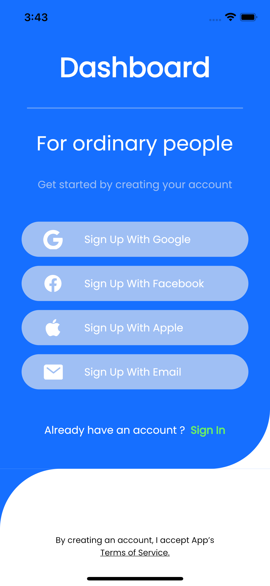

# dashboard_design

A new Flutter Dashboard Design project.

# Clean architecture flutter app

A clean architecture Dashboard Design App, made with Flutter sdk.

The main goal is to build readable, maintainable, testable, and high-quality flutter app using test-driven-design styled architecture.

## Screenshots

  

## Technologies

### Architecture
- **Test-driven-design**
- **Clean Architecture**

### Front-end
- **Flutter SDK**
- **flutter_screenutil** - [Link](https://pub.dev/packages/flutter_screenutil)

# Author 🙋

-   **Shivam Shashank** - [LinkedIn](https://www.linkedin.com/in/shivam-shashank-2b5766217/)
